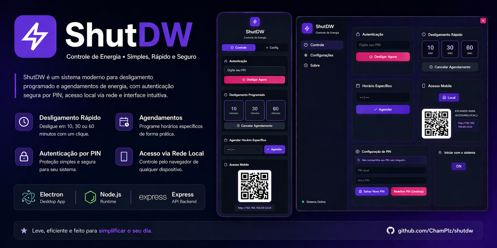

<p align="center">
  
</p>

<h1 align="center">⚡ ShutDW</h1>

<p align="center">
  A modern desktop app to remotely shut down your computer, schedule power actions, and control everything from your phone.
</p>

<p align="center">
  <strong>Simple • Fast • Secure</strong>
</p>

<p align="center">
  
  
  
  
</p>

---

## ✨ Features

- 🖥️ **Desktop App (Windows)** built with Electron  
- 🌐 **Web Interface** accessible from any browser (PC or mobile)  
- 📱 Remote control from your phone (same network)  
- ⏳ Shutdown countdown timer  
- ⏰ Quick scheduling (10, 30, 60 minutes)  
- 🕒 Schedule shutdown at a specific time  
- ❌ Cancel scheduled shutdowns anytime  
- 🔐 PIN-protected actions  
- 💾 Persistent configuration  
- 🧲 System tray support (runs in background)  
- 🎨 Clean and modern UI  

---

## 📸 Screenshots

<p align="center">
  
  
  
</p>

---

## 🚀 Getting Started

### 1️⃣ Download (Recommended)

Download the latest installer from the **Releases** section and run it on Windows.

After launching:

- The app runs in the background  
- A tray icon will appear  
- The web interface becomes accessible  

---

### 2️⃣ Access from Mobile

With the app running, open in your browser:

<http://localhost:3333>

The app also provides:

- 📲 QR Code for quick access  
- 🔗 Local network IP link  

---

## 🛠️ Development

### Requirements

- Node.js 18+
- npm or yarn

### Installation

```bash
git clone https://github.com/ChamPlz/shutdw.git
cd shutdw
npm install
```

### Run in development

```bash
npm run dev
```

### Build executable

```bash
npm run build
```

---

## 🧱 Tech Stack

- **Electron** — Desktop application  
- **Node.js** — Runtime  
- **Express** — Backend server  
- **HTML / CSS / JavaScript** — Frontend  
- **QRCode** — Mobile access  

---

## 🔐 Security

- PIN-protected actions  
- Local network only (no external exposure)  
- No dependency on third-party services  

---

## 📜 License

This project is open-source for **non-commercial use**.

- ✅ Personal and educational use  
- ❌ Commercial use requires a paid license  

📧 Contact for commercial licensing:  
**<carloscaldeira23@gmail.com>**

See the `LICENSE` file for more details.

---

## 🤝 Contributing

Contributions are welcome!

1. Fork the repository  
2. Create a branch (`feature/your-feature`)  
3. Commit your changes  
4. Open a Pull Request 🚀  

---

## ⭐ Support

If you like this project:

- ⭐ Star the repository  
- 📢 Share it with others  
- 💬 Give feedback  

---
